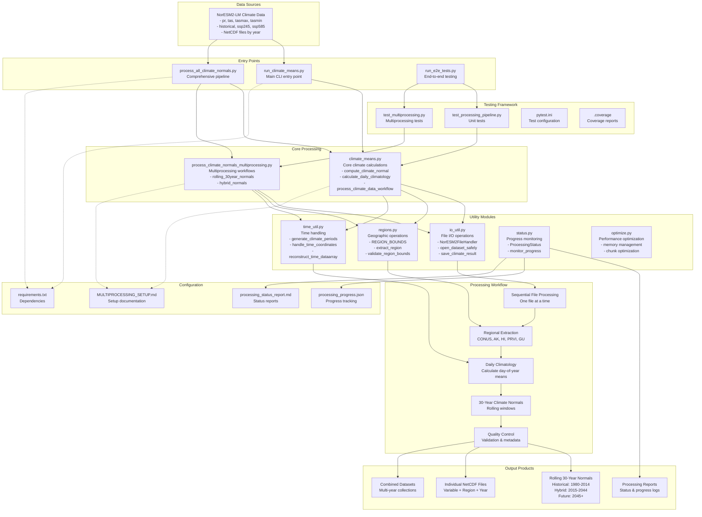

# Climate Data Processing Codebase Architecture

This document describes the architecture and data flow of the climate data processing codebase using a visual mermaid diagram.

## Overview

This is a Python-based climate data processing pipeline that calculates 30-year climate normals from NetCDF climate model data. The system has evolved from a distributed Dask-based approach to a sequential processing architecture for improved reliability with NetCDF files.

## System Architecture

## Key Components

### 1. Entry Points
- **`run_climate_means.py`**: Main CLI interface with different modes (demo, noresm2, example)
- **`process_all_climate_normals.py`**: Comprehensive pipeline for processing all variables and scenarios
- **`run_e2e_tests.py`**: End-to-end testing framework

### 2. Core Processing Modules
- **`climate_means.py`**: Central processing logic with climate calculations and workflow orchestration
- **`process_climate_normals_multiprocessing.py`**: Specialized multiprocessing workflows for large-scale processing

### 3. Utility Modules
- **`io_util.py`**: File I/O operations and NorESM2 data handling
- **`regions.py`**: Geographic region definitions and extraction functions
- **`time_util.py`**: Time coordinate handling and period generation
- **`status.py`**: Progress monitoring and status reporting
- **`optimize.py`**: Performance optimization and memory management

### 4. Processing Architecture

The system follows a **sequential processing** approach that has evolved from an earlier Dask-based distributed system. Key characteristics:

- **Sequential file processing**: One NetCDF file at a time to avoid threading issues
- **Regional extraction**: Support for CONUS, Alaska, Hawaii, Puerto Rico, and Guam
- **Conservative memory management**: Aggressive garbage collection and safe chunking
- **Crash-resistant design**: Retry logic and graceful error handling

### 5. Data Flow

1. **Input**: NorESM2-LM climate model data (NetCDF files organized by variable/scenario/year)
2. **Processing**: Sequential processing with regional extraction and daily climatology calculation
3. **Computation**: 30-year rolling climate normals using historical and future scenario data
4. **Output**: NetCDF files with climate normals, metadata, and processing statistics

### 6. Output Products

The system generates three types of climate normals:
- **Historical normals** (1980-2014): Using only historical data
- **Hybrid normals** (2015-2044): Combining historical and future scenario data
- **Future normals** (2045+): Using only future scenario data

### 7. Testing Framework

Comprehensive testing includes:
- Unit tests for core processing functions
- Multiprocessing-specific tests
- End-to-end pipeline validation
- Coverage reporting with pytest

## Architecture Benefits

1. **Reliability**: Sequential processing avoids NetCDF threading issues
2. **Memory efficiency**: Conservative chunking and garbage collection
3. **Modularity**: Clear separation of concerns across utility modules
4. **Maintainability**: Comprehensive testing and documentation
5. **Flexibility**: Support for multiple regions, variables, and scenarios
6. **Monitoring**: Built-in progress tracking and status reporting

## Technology Stack

- **Python 3.12**: Core language
- **xarray**: NetCDF data manipulation
- **numpy**: Numerical computations
- **pandas**: Data analysis and time handling
- **netCDF4**: Low-level NetCDF operations
- **pytest**: Testing framework
- **uv**: Package management (as specified in user rules)

This architecture represents a mature, production-ready climate data processing system optimized for reliability and scientific reproducibility. 