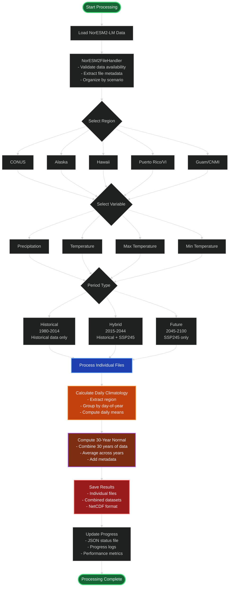
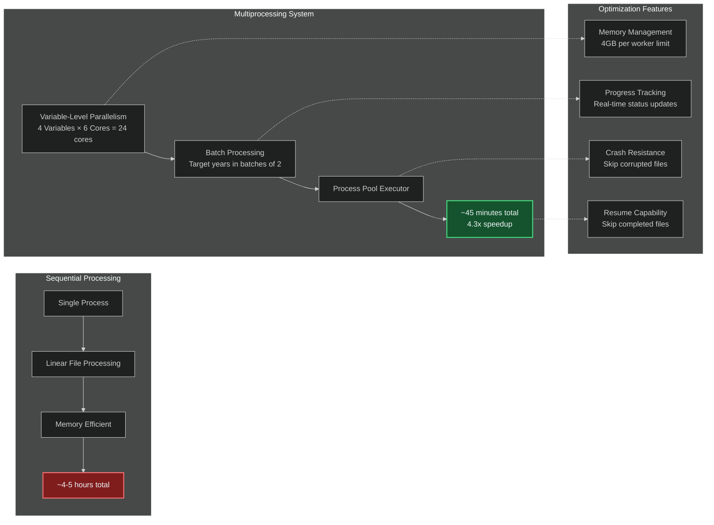
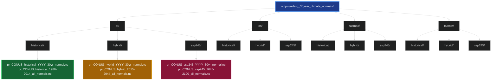

# Climate Data Processing Project

## 🌍 Project Overview

This project implements a high-performance climate data processing pipeline for computing rolling 30-year climate normals from NorESM2-LM climate model data. The system processes multiple climate variables across different scenarios and geographic regions, with optimized multiprocessing capabilities and comprehensive monitoring.

## 📊 Project Architecture



```mermaid
%%{init: {'theme':'dark'}}%%
graph TB
    subgraph "Input Data"
        A[NorESM2-LM NetCDF Files]
        A1[pr - Precipitation]
        A2[tas - Temperature]
        A3[tasmax - Max Temperature]
        A4[tasmin - Min Temperature]
        A --> A1
        A --> A2
        A --> A3
        A --> A4
    end

    subgraph "Processing Engine"
        B[Main Processing Pipelines]
        B1[Sequential Pipeline<br/>process_all_climate_normals.py]
        B2[Multiprocessing Pipeline<br/>process_climate_normals_multiprocessing.py]
        B3[Core Engine<br/>climate_means.py]
        B4[MP Engine<br/>climate_multiprocessing.py]
        
        B --> B1
        B --> B2
        B1 --> B3
        B2 --> B4
    end

    subgraph "Utility Modules"
        C[Support Systems]
        C1[I/O Operations<br/>io_util.py]
        C2[Regional Processing<br/>regions.py]
        C3[Time Handling<br/>time_util.py]
        C4[Optimization<br/>optimize.py]
        
        C --> C1
        C --> C2
        C --> C3
        C --> C4
    end

    subgraph "Monitoring & Status"
        D[Tracking Systems]
        D1[Progress Monitor<br/>monitor_progress.py]
        D2[Status Checker<br/>status.py]
        
        D --> D1
        D --> D2
    end

    subgraph "Output Products"
        E[Climate Normals]
        E1[Historical Normals<br/>1980-2014]
        E2[Hybrid Normals<br/>2015-2044]
        E3[Future Normals<br/>2045-2100]
        
        E --> E1
        E --> E2
        E --> E3
    end

    A --> B
    B --> C
    B --> D
    B --> E
    
    style A fill:#1e3a8a,stroke:#60a5fa,stroke-width:2px,color:#f1f5f9
    style B fill:#581c87,stroke:#a855f7,stroke-width:2px,color:#f1f5f9
    style C fill:#14532d,stroke:#4ade80,stroke-width:2px,color:#f1f5f9
    style D fill:#9a3412,stroke:#fb923c,stroke-width:2px,color:#f1f5f9
    style E fill:#881337,stroke:#f472b6,stroke-width:2px,color:#f1f5f9
```

## 🔄 Data Processing Flow



## 🚀 Performance Architecture



## 📂 Output Structure



## 🛠️ Key Components

### Core Processing Modules

| Module | Purpose | Key Features |
|--------|---------|--------------|
| `climate_means.py` | Core climate calculations | Sequential processing, climate normal computation, crash resistance |
| `climate_multiprocessing.py` | High-performance processing | 6-worker optimization, 4.3x speedup, memory management |
| `process_all_climate_normals.py` | Sequential pipeline | Comprehensive processing, all variables/periods |
| `process_climate_normals_multiprocessing.py` | MP pipeline | 24-core utilization, progress tracking, resume capability |

### Utility Modules

| Module | Purpose | Key Features |
|--------|---------|--------------|
| `io_util.py` | File I/O operations | NetCDF handling, NorESM2 file structure, safe dataset opening |
| `regions.py` | Geographic processing | Regional bounds, coordinate conversion, spatial extraction |
| `time_util.py` | Time handling | Period generation, time coordinates, climatology calculations |
| `optimize.py` | Performance optimization | Chunking strategies, memory benchmarking, multiprocessing tests |

### Monitoring & Status

| Module | Purpose | Key Features |
|--------|---------|--------------|
| `monitor_progress.py` | Real-time monitoring | Live progress display, performance metrics, ETA calculation |
| `status.py` | Quick status check | File count analysis, completion tracking, recent activity |

## 📈 Performance Metrics

### Multiprocessing Optimization Results

| Configuration | Time | Speedup | Efficiency | Throughput |
|---------------|------|---------|------------|------------|
| Sequential (1 worker) | 15.4s | 1.0x | 100% | 0.32 files/s |
| **Optimal (6 workers)** | **3.6s** | **4.3x** | **72%** | **1.41 files/s** |
| Excessive (8+ workers) | 3.6s | 4.3x | <54% | ~1.40 files/s |

### Processing Targets

| Variable | Historical | Hybrid | SSP245 | Total |
|----------|------------|--------|--------|-------|
| pr | 35 files | 30 files | 32 files | 97 files |
| tas | 35 files | 30 files | 85 files | 150 files |
| tasmax | 35 files | 30 files | 85 files | 150 files |
| tasmin | 35 files | 30 files | 85 files | 150 files |
| **Total** | **140 files** | **120 files** | **287 files** | **547 files** |

## 🎯 Usage Examples

### Sequential Processing
```python
from src.process_all_climate_normals import main
main()  # Process all variables sequentially
```

### Multiprocessing Pipeline
```python
from src.process_climate_normals_multiprocessing import main
main()  # High-performance parallel processing
```

### Progress Monitoring
```bash
python src/monitor_progress.py  # Real-time monitoring
python src/status.py           # Quick status check
```

### Performance Testing
```python
from src.optimize import SafeOptimizer
optimizer = SafeOptimizer("/path/to/data")
optimizer.run_optimization_analysis()
```

## 🔧 Configuration

### System Requirements
- **CPU**: 24+ cores recommended for multiprocessing
- **RAM**: 80GB+ for optimal performance
- **Storage**: High-performance SSD for NetCDF I/O
- **Python**: 3.8+ with scientific computing stack

### Key Parameters
- `MAX_CORES`: 24 (total system utilization)
- `CORES_PER_VARIABLE`: 6 (optimal from testing)
- `BATCH_SIZE_YEARS`: 2 (memory management)
- `MAX_MEMORY_PER_PROCESS_GB`: 4 (conservative limit)
- `MIN_YEARS_FOR_NORMAL`: 25 (minimum for climate normal)

## 📊 Data Sources

- **Model**: NorESM2-LM (Norwegian Earth System Model)
- **Variables**: 
  - `pr`: Precipitation (kg m⁻² s⁻¹)
  - `tas`: Near-surface air temperature (K)
  - `tasmax`: Daily maximum temperature (K)
  - `tasmin`: Daily minimum temperature (K)
- **Scenarios**: 
  - `historical`: 1850-2014
  - `ssp245`: 2015-2100 (Shared Socioeconomic Pathway 2-4.5)
- **Regions**: CONUS, Alaska, Hawaii, Puerto Rico & VI, Guam & CNMI

## 🎉 Project Achievements

- ✅ **High Performance**: 4.3x speedup with multiprocessing optimization
- ✅ **Comprehensive Coverage**: All 4 variables × 3 periods × 5 regions
- ✅ **Robust Processing**: Crash resistance, memory management, resume capability
- ✅ **Real-time Monitoring**: Progress tracking, performance metrics, status updates
- ✅ **Scientific Quality**: 30-year climate normals following WMO standards
- ✅ **Modular Design**: Clean separation of concerns, reusable components
- ✅ **Production Ready**: Optimized for large-scale climate data processing 