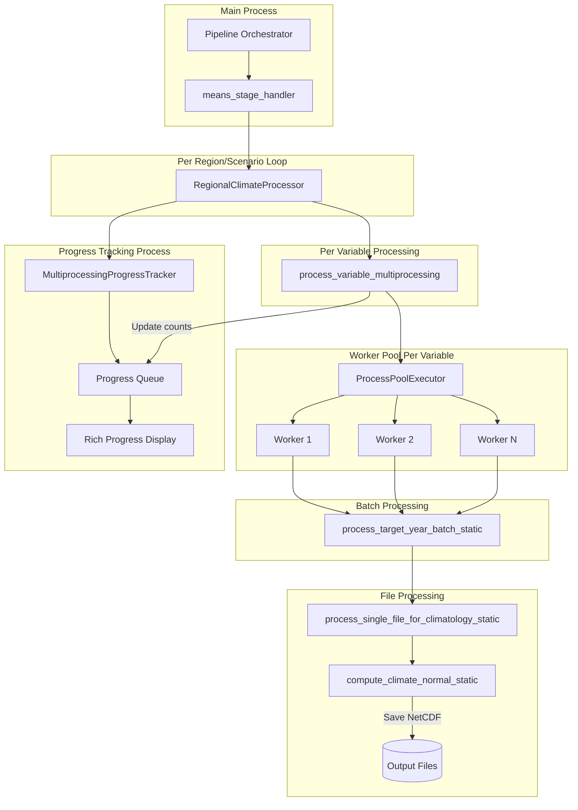

# Phase 1 Multiprocessing Architecture

## Overview
The Phase 1 climate means processing uses a hierarchical multiprocessing architecture to efficiently process large volumes of climate data across multiple variables, regions, and scenarios.

## Architecture Diagram



## Processing Flow

### 1. **Orchestration Level**
- **Pipeline Orchestrator** calls `means_stage_handler`
- Configuration specifies: 4 variables × 5 regions × 3 scenarios = 60 tasks

### 2. **Stage Handler Level** (`means_stage_handler`)
- Loops through each region (CONUS, AK, HI, PRVI, GU)
- For each region, loops through scenarios (historical, ssp245, ssp585)
- Creates a `RegionalClimateProcessor` for each region/scenario combination
- Processes all 4 variables (pr, tas, tasmax, tasmin) simultaneously

### 3. **Progress Tracking** (Separate Process)
- `MultiprocessingProgressTracker` runs in its own process
- Communicates via a multiprocessing Queue
- Displays Rich terminal UI with:
  - Per-variable progress bars
  - File counts and throughput
  - System statistics (CPU, memory)

### 4. **Regional Climate Processor**
- **File Counting Phase**: 
  - Counts all files upfront for accurate progress tracking
  - Updates progress tracker with actual file counts
- **Processing Phase**:
  - Calls `process_variable_multiprocessing` for each variable

### 5. **Variable Multiprocessing** (`process_variable_multiprocessing`)
- For each variable, processes three time periods:
  - Historical (1980-2014): 35 target years
  - Hybrid (2015-2044): 30 target years  
  - SSP245 (2045-2100): 56 target years
- Creates batches of target years (batch_size_years parameter)
- Uses `ProcessPoolExecutor` with configurable workers per variable

### 6. **Worker Pool**
- Each variable gets its own worker pool
- Workers process batches of target years in parallel
- Workers call static functions (to avoid pickling issues):
  - `process_target_year_batch_static`
  - `process_single_file_for_climatology_static`
  - `compute_climate_normal_static`

### 7. **Batch Processing** (`process_target_year_batch_static`)
For each target year in the batch:
- Determines which 30 years of files to process
- Checks if output already exists (skip if yes)
- Processes each file to extract daily climatology
- Computes 30-year climate normal
- Saves result as NetCDF

### 8. **File Processing**
- **Extract Region**: Subsets global data to regional bounds
- **Time Handling**: Fixes time coordinates and creates day-of-year index
- **Daily Climatology**: Groups by day-of-year and averages
- **30-Year Normal**: Stacks all years and computes mean

## Parallelization Strategy

### Level 1: Region/Scenario
- Sequential processing (could be parallelized in future)
- 5 regions × 3 scenarios = 15 iterations

### Level 2: Variables  
- All 4 variables processed simultaneously within each region/scenario
- Each variable gets `cores_per_variable` workers

### Level 3: Target Years
- Years are batched (e.g., 2-10 years per batch)
- Batches processed in parallel by worker pool

### Level 4: Files (within each target year)
- Sequential processing of ~30 files per target year
- Each file represents one year of daily data

## Configuration Parameters

```yaml
multiprocessing_workers: 12      # Total workers available
cores_per_variable: 3           # Workers per variable (12/4 = 3)
batch_size_years: 2             # Years per batch
max_memory_per_worker_gb: 6.0   # Memory limit per worker
```

## Progress Communication

1. **Main → Progress Tracker**: Via `progress_queue`
2. **Updates flow**:
   - File counts: Updated after initial counting
   - Batch completion: Estimated progress updates
   - Task completion: Final status updates

## Memory Management

- Workers use `gc.collect()` after processing each target year
- Static functions avoid keeping large objects in memory
- Output files saved immediately and data cleared

## Error Handling

- Try-except blocks at each level
- Failed files logged but don't stop processing
- Batch failures reported back to main process
- Incomplete years skipped with warnings