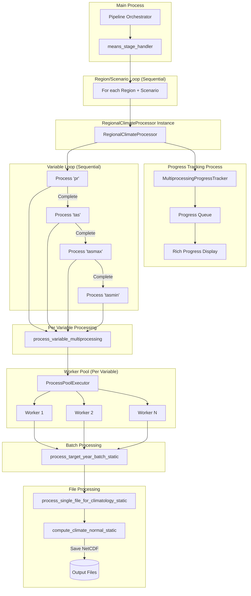

# Phase 1 Multiprocessing Architecture (Corrected)

## Overview
The Phase 1 climate means processing uses a hierarchical multiprocessing architecture where variables are processed **sequentially**, not in parallel.

## Architecture Diagram



## Actual Processing Flow

### 1. **Stage Handler Level** (`means_stage_handler`)
```python
# Loops sequentially through regions and scenarios
for region in regions:
    for scenario in scenarios:
        # Creates ONE RegionalClimateProcessor that handles ALL variables
        processor = RegionalClimateProcessor(config)
        processor.process_all_variables()  # This processes variables SEQUENTIALLY
```

### 2. **Regional Climate Processor** (`process_all_variables`)
```python
# Variables are processed ONE AT A TIME
for variable in self.config.variables:  # ['pr', 'tas', 'tasmax', 'tasmin']
    # Process this variable completely before moving to next
    variable_results = self.process_variable_multiprocessing(variable)
    # Mark as completed
    self.progress_tracker.complete_task(variable, "completed")
```

### 3. **Variable Processing** (`process_variable_multiprocessing`)
For EACH variable (sequentially):
- Processes three time periods: historical, hybrid, ssp245
- Creates batches of target years
- Uses ProcessPoolExecutor with multiple workers
- Workers process year batches in parallel

## Sequential vs Parallel Breakdown

### **SEQUENTIAL Processing**:
1. **Regions** - Processed one at a time
2. **Scenarios** - Processed one at a time within each region
3. **Variables** - Processed one at a time within each region/scenario
4. **Time Periods** - Processed one at a time within each variable

### **PARALLEL Processing**:
1. **Year Batches** - Multiple workers process different year batches simultaneously
2. **Only within a single variable** - Parallelization happens at the year-batch level

## Example Timeline

For CONUS/historical:
```
Time →
[pr    ] ████████████████████ (complete all years for pr)
[tas   ]                      ████████████████████ (then start tas)
[tasmax]                                           ████████████████████
[tasmin]                                                                ████████████████████
```

NOT like this:
```
Time →
[pr    ] ████████████████████
[tas   ] ████████████████████  ← This does NOT happen
[tasmax] ████████████████████
[tasmin] ████████████████████
```

## Worker Allocation

When processing a single variable:
- All available workers (e.g., 12) work on that one variable
- Workers process different year batches in parallel
- Example: If processing 'tas' with 12 workers:
  - Worker 1: Years 1980-1981
  - Worker 2: Years 1982-1983
  - Worker 3: Years 1984-1985
  - ... etc

## Progress Tracking

The Rich progress display shows all variables, but only ONE is active at a time:
```
Processing TAS data      ━━━━━━━━━━━━━━━━━━━━━━━━━━━   523/3630 0:05:23  ← Active
Processing PR data       ━━━━━━━━━━━━━━━━━━━━━━━━━━━  3630/3630 ✓ Complete  ← Finished
Processing TASMAX data   ━━━━━━━━━━━━━━━━━━━━━━━━━━━     0/3630 0:00:00  ← Waiting
Processing TASMIN data   ━━━━━━━━━━━━━━━━━━━━━━━━━━━     0/3630 0:00:00  ← Waiting
```

## Configuration Impact

Even though the configuration specifies:
```yaml
multiprocessing_workers: 12
cores_per_variable: 3  # This is calculated but not used as intended
```

In reality:
- All 12 workers are used for the current variable
- The `cores_per_variable` calculation doesn't limit workers
- Each variable gets the full worker pool

## Why Sequential Variables?

This design choice likely ensures:
1. **Memory efficiency** - Only one variable's data in memory at a time
2. **Simpler error handling** - Clear which variable failed
3. **Progress clarity** - Easy to track which variable is processing
4. **Resource focus** - All workers focused on one variable maximizes throughput for that variable