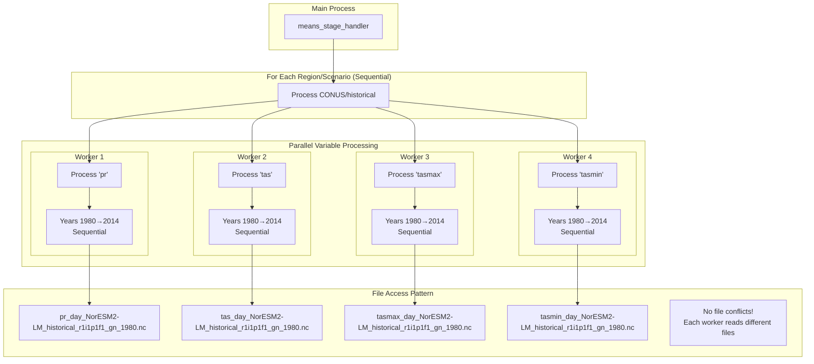

# Phase 1 Multiprocessing - Ideal Architecture

## Key Constraint: NetCDF File Access
NetCDF files do not support concurrent reads of the same file, which means:
- ❌ Cannot have multiple workers reading the same file simultaneously
- ✅ CAN have workers reading different variable files simultaneously (pr, tas, tasmax, tasmin are in separate files)

## Current vs Ideal Architecture

### Current (Inefficient):
```
Variables: Sequential ❌
Years: Parallel (attempting to read same files) ❌
```

### Ideal (Efficient):
```
Variables: Parallel ✅ (different files)
Years: Sequential ✅ (within each variable)
Regions: Sequential ✅ (same files, different spatial subset)
```

## Ideal Architecture Diagram



## Why This Architecture Makes Sense

### 1. **File Organization**
```
/CLIMATE_DATA/NorESM2-LM/
├── pr/
│   ├── historical/
│   │   ├── pr_day_NorESM2-LM_historical_r1i1p1f1_gn_1980.nc
│   │   ├── pr_day_NorESM2-LM_historical_r1i1p1f1_gn_1981.nc
│   │   └── ...
├── tas/
│   ├── historical/
│   │   ├── tas_day_NorESM2-LM_historical_r1i1p1f1_gn_1980.nc
│   │   └── ...
├── tasmax/
│   └── ...
└── tasmin/
    └── ...
```

Each variable has its own set of files - no conflicts when reading in parallel!

### 2. **30-Year Window Processing**
For each target year (e.g., 2010), we need to read 30 files (1981-2010):
- These files must be read sequentially for each variable
- But different variables can process their 30-year windows simultaneously

### 3. **Memory Efficiency**
- Each variable worker loads only its own data
- No competition for file handles
- Better cache utilization

## Proposed Implementation Changes

### 1. **Restructure process_all_variables()**
```python
def process_all_variables(self):
    """Process all variables in PARALLEL."""
    
    # Create a process pool with one worker per variable
    with ProcessPoolExecutor(max_workers=len(self.config.variables)) as executor:
        # Submit all variables for parallel processing
        future_to_variable = {
            executor.submit(
                process_variable_complete,  # New function
                variable,
                self.config,
                self.progress_queue
            ): variable
            for variable in self.config.variables
        }
        
        # Wait for all variables to complete
        for future in as_completed(future_to_variable):
            variable = future_to_variable[future]
            try:
                result = future.result()
                logger.info(f"✅ Completed {variable}")
            except Exception as e:
                logger.error(f"❌ Failed {variable}: {e}")
```

### 2. **Sequential Year Processing Within Variable**
```python
def process_variable_complete(variable, config, progress_queue):
    """Process ALL years for a single variable sequentially."""
    
    for period in ['historical', 'hybrid', 'ssp245']:
        for target_year in get_period_years(period):
            # Process 30-year window for this target year
            files = get_30_year_files(variable, target_year)
            
            daily_climatologies = []
            for file_path in files:  # Sequential file reading
                data = read_and_process_file(file_path)
                daily_climatologies.append(data)
            
            # Compute and save climate normal
            climate_normal = compute_normal(daily_climatologies)
            save_output(climate_normal, variable, target_year)
            
            # Update progress
            update_progress(progress_queue, variable, 1)
```

## Benefits of Ideal Architecture

### 1. **No File Conflicts**
- Each worker reads completely different files
- No NetCDF locking issues

### 2. **Better Parallelization**
- 4x speedup for 4 variables (theoretical max)
- Currently: Must wait for each variable to complete

### 3. **Simpler Code**
- No need for complex year batching
- Natural work division by variable

### 4. **Progress Tracking**
- Each variable progresses independently
- More accurate progress bars

## Resource Allocation Example

With 16 cores available:
- **Current**: 16 cores try to read same variable files (conflicts!)
- **Ideal**: 4 cores each reading different variable files (no conflicts!)

```
Core 1-4:   pr files (sequential years)
Core 5-8:   tas files (sequential years)  
Core 9-12:  tasmax files (sequential years)
Core 13-16: tasmin files (sequential years)
```

## Implementation Priority

This architectural change would:
1. Eliminate NetCDF file access conflicts
2. Improve processing speed significantly
3. Simplify the codebase
4. Make progress tracking more accurate

The key insight: **Parallelize what can truly run in parallel (different files), serialize what must be sequential (same files)**.